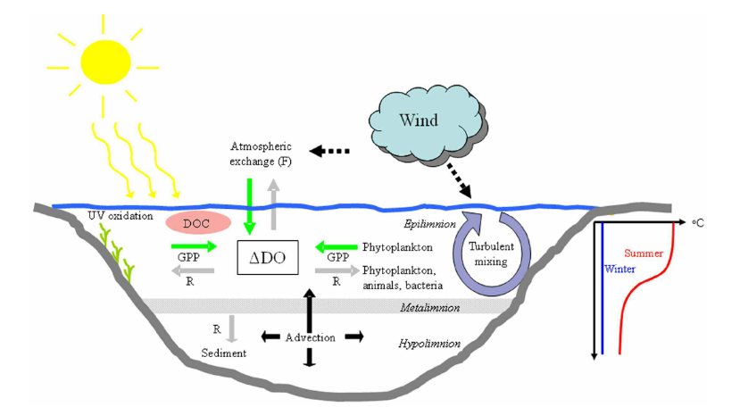

# Introducción

## Metabolismo de ecosistemas acuáticos

En el medio acuático tienen lugar todos los procesos metabólicos a través de los cuales la vida ha encontrado la manera de perpetuar su existencia modificando las sustancias que le rodean. La diversidad de las rutas a través de las cuales los organismos son capaces de obtener energía para realizar todos los procesos vitales es inabarcable en una práctica y, además, no es el objetivo final de esta. Sin embargo, las dos principales rutas que dominan el mundo aeróbico, debido a su gran eficiencia frente a las demás, son la fotosíntesis oxigénica y la respiración aeróbica ^[A partir de ahora, siempre que nos refiramos a la fotosíntesis o a la respiración a secas nos estamos refieriendo a la fotosíntesis oxigénica y la respiración aeróbica.], el resto de rutas encuentra su máxima relevancia en aquellos nichos en los que se dan las condiciones adecuadas y no son posible otros mecanismos más eficientes de obtención de energía. Por lo tanto, en un sistema acuático bien oxigenado los dos principales procesos que tienen un mayor impacto en el ecosistema son la fotosíntesis y la respiración. Del balance entre ambos procesos puede depender la cálidad del agua, tornándose anóxica, si prima la respiración por encima de los procesos de producción primaria, y comprometiendo muchas formas de vida. Además, ambos procesos juegan un papel relevante en el ciclo del carbono, retirando CO~2~ del entorno mediante la fotosíntesis (PP) o liberando CO~2~ a través de la respiración.

Al igual que a nivel de organismo o de individuo, el metabolismo puede ser interpretado a nivel de ecosistema como el conjunto de procesos metabolicos que tienen lugar en dicho ecosistema. Como hemos dicho anteriormente, en un sistema acuático bien oxigenado, fotosíntesis y respiración son los procesos más importantes que determinan el metabolismo del ecosistema y su papel en los ciclos biogeoquímicos globales.

Si queremos estimar el metabolismo aeróbico de un lago, los cambios en la concentración de oxígeno disuelto (OD) es una de las variables más utilizadas. Esta puede ser medida en botellas de incubación y monitorizar el cambio en la concentración de O~2~ durante un periodo de tiempo determinado y en un volumen de agua concreto. Esto ofrece la ventaja de controlar las condiciones ambientales (temperatura, irradiancia, etc) y poder realizar replicas. Sin embargo, el "efecto contenedor" conlleva ciertas limitaciones a la hora de escalar a nivel de ecosistema. Otra manera puede ser medir los cambios en la concentración de oxígeno directamente en la masa de agua ("aguas libres"), de este modo el escalado a nivel del conjunto de la masa es más realista, no sin ciertas límitaciones e incertidumbres [@Staehr2007,@Mccutchan1998,@Hanson2008,@Staehr2010]. Sabemos que la respiración y la producción primaria afectan directamente a la concentración de OD, consumiendo oxígeno en el primer caso y produciendolo en el segundo. Sin embargo, hay otros factores físicos que pueden afectar a la concentración de OD (Ver figura). Por lo tanto, podríamos definir el cambio en la concentración de oxígeno con la siguiente ecuación:

$$\frac{\Delta OD}{\Delta t} = GPP - R - At_{ex} - E$$

Donde, GPP es la producción primaria bruta, R es la respiración, At~ex~ es el intercambio gaseoso con la atmósfera y E serían otros factores, de menor magnitud, que afectan a la concentración de OD como, por ejemplo, la oxidación fotoquímica de la materia orgánica o advección.

Por lo tanto, si medimos los cambios que se producen en la concentración de OD durante un día completo en un lago, y podemos calcular el intercambio gaseoso de O~2~ que se produce entre la masa de agua y la atmósfera, podremos estimar su metabolismo. Por la noche, el cambio en la concentración de OD, no producto del intercambio gaseoso, será debido a la respiración. Durante el día, sin embargo, este cambio será debido a la producción neta (NEP). Conociendo que $NEP = GPP - R$ y habiendo calculado la respiración, podemos averiguar cual es la producción primaria bruta del sistema. 

Este modelo tiene ciertas asunciones que conviene tener presente:

  1. Los cambios en la concentración de OD son el resultado del balance entre producción fotosintética y respiración así como del intercambio con la atmósfera. Es decir, asume que E es despreciable.
  2. La producción primaria tiene lugar solo durante el día.
  3. La tasa de respiración durante la noche es la misma que durante el día.

